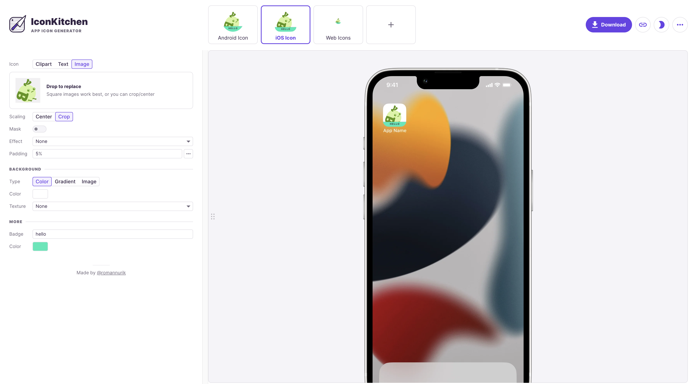
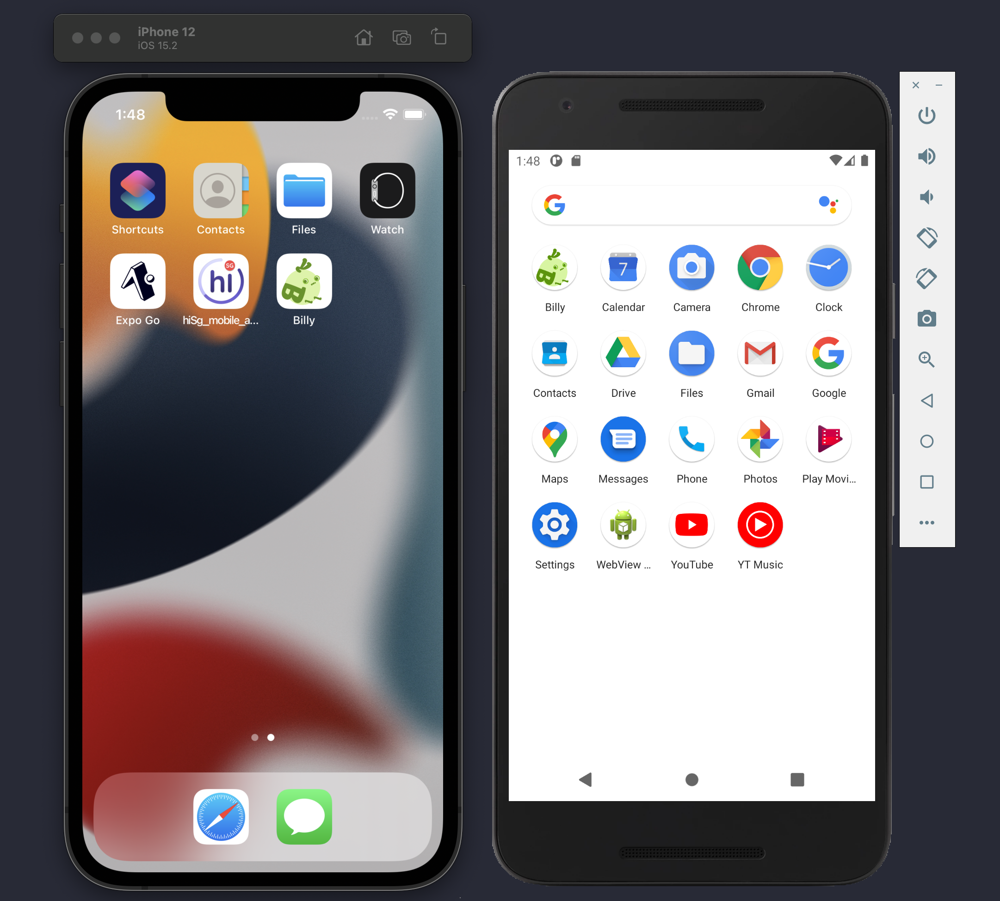
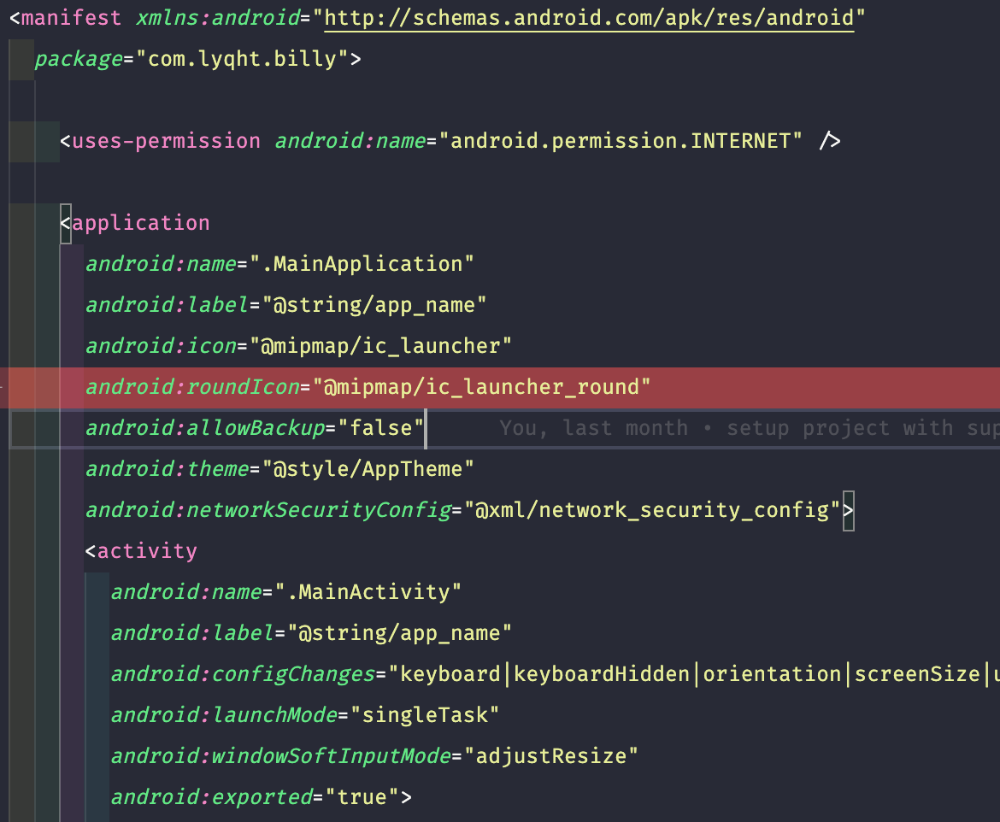
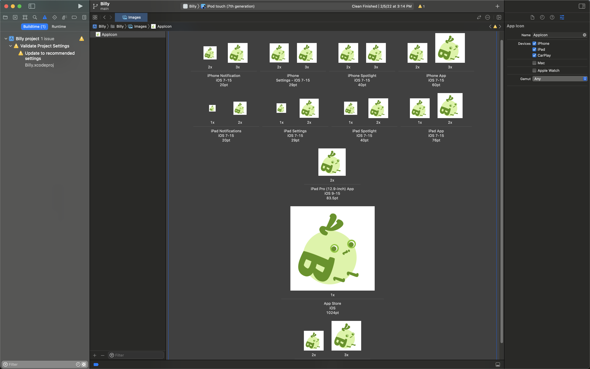
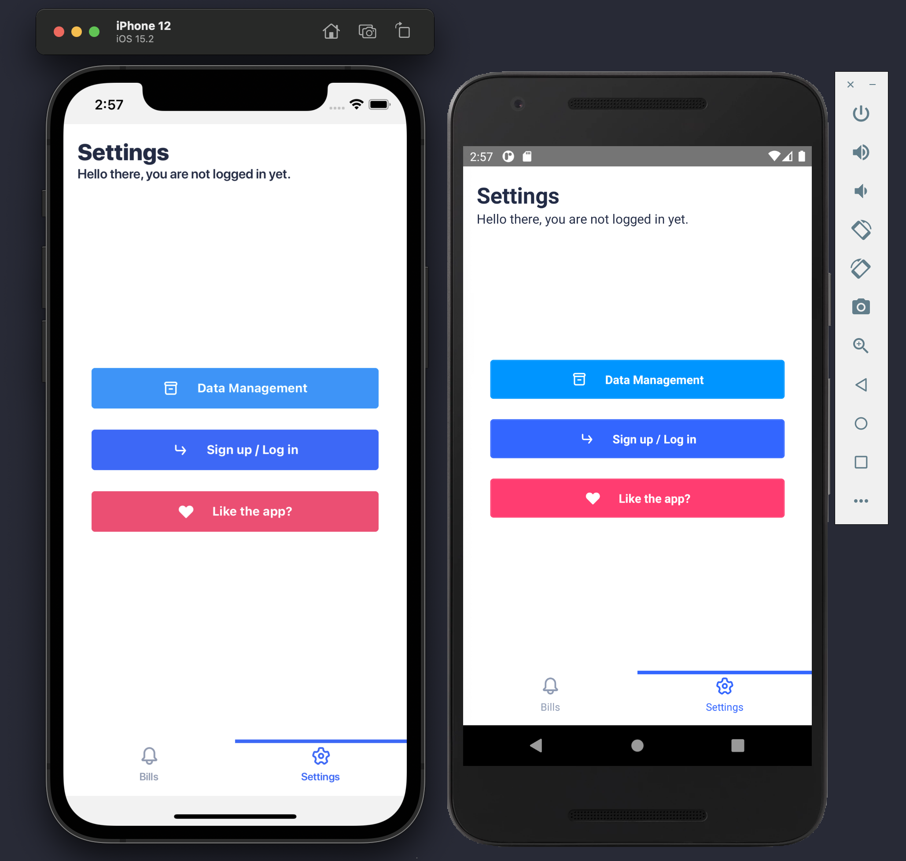
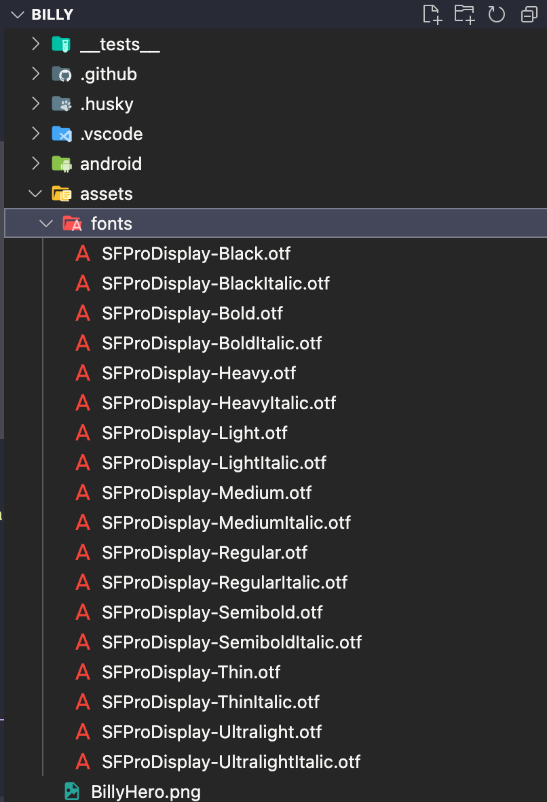

## Introduction

Having custom assets is pretty important to make your app look unique for both branding and user experiences purposes.

On desktop, in the _millions_ of tabs that are left open in the browser, users find their target web application primarily via favicons. Likewise, on mobile, among the many apps that they have already installed and kindly arranged into grids, **users locate the app that they want to use mainly by their app icons**. Therefore it is imperative to have a distinct app icon to your application.

After they managed to find your app and get into it, you would also want them to have a good time there. The primary mediums of content are images and text. For text, depending on the language and tone that you want to express through your app, you would want to incorporate specific fonts that complement well instead of using the default native fonts (Android default is Roboto, iOS default is San Francisco).

Hence, in this article, I will teach you how to add your own app icon, custom fonts, and images in a React Native mobile application.


> 🐙 Most instructions here are based on how I added custom assets to my own React Native project, Billy! The source code can be found [here](https://github.com/lyqht/Billy/tree/main).

## Adding an App icon

First, make sure you already have an image of square dimensions, e.g. 512x512. Then you can go to [Icon Kitchen](https://icon.kitchen/) to **preview the icon on different platforms**: Android, iOS and even web! There are also some default icons there for you to try out if you don't want to make your own.

You can adjust the padding of the icon so that your main graphic is not cropped out and also add a sample badge for preview (frequently present on Shopping apps in the form of 11.11 sale etc).



Click "Download" and you can find the following content for android and ios icons in the unzipped folder.

- android
  - mipmap-anydpi-v26
  - mipmap-hdpi
  - mipmap-mdpi
  - mipmap-xhdpi
  - mipmap-xxhdpi
  - mipmap-xxxhdpi
- ios
  - AppIcon*.png
  - AppIcon*@2x.png
  - AppIcon*@3x.png

After following the instructions for adding app icons on Android and iOS below, you would be able to get results similar to what is shown in the screenshot below of my app installed both an iOS iPhone 12 simulator and an Android Nexus 5X emulator.



#### Android

1. Drag all the content you have downloaded from the android folder of the generated ouput into your own project's `android/main/res`. 
2. You may have an additional default `ic_launcher_round` file in each of your original `res` folders, but it's safe to remove it (Refer to the screenshot above, the icons are round). 
3. After replacing the content, in the `AndroidManifest.xml` file, remove the property for `android:roundIcon="@mipmap/ic_launcher_round"`. Otherwise on building the app, you will encounter an error saying that the file is missing.

    Here's a snapshot of the removed line.
    

4. Now, you can build the app on android with
    ```bash
    npm run android
    ```
5. Enjoy your new app icon on Android! 🎉

#### iOS

1. Create a folder `AppIcon.appiconset` under `ios/<AppName>/Images.xcassets`. 
2. Drag all the images in the generated app icons ios folder over to this new folder. 
3. In this new folder, create another file `Contents.json`, with the same content as [this file](https://github.com/lyqht/Billy/blob/main/ios/Billy/Images.xcassets/AppIcon.appiconset/Contents.json).
4. Now you can build the app on iOS
   ```bash
   npm run ios
   ``` 
5. Enjoy your new app icon on iOS! 🎉

> FYI: If you are curious how the `Images.xcassets` folder and its `Contents.json` is generated, In most other guides, the usual way of setting the icons in most guides is to open Xcode > AppName > Images, and manually drag pictures into the slots with specific dimensions shown in the screenshot.
> 
> 
> 
> On XCode, you can also enable additional icon settings for iPad & CarPlay on the right sidebar to show up more slots. After assigning them, you would have all slots filled, and the folder with the `Images.xcassets` folder and its `Contents.json` will be ready for building the app.
> 
> 
> 
> This manual process is actually what I've done too. But if you are following this guide, you can take away the manual labor work of checking the dimensions and assigning each of those icons, since we would have the same set of icon names in `Contents.json` ✨

## Adding custom fonts

Here's an example result when you have the same font of Sans Franscio Display Pro on both platforms. It's not that common that you get to see an iOS font on an android app 😆




**2 important things** to note for adding custom fonts:
1. Font files must be either in `.ttf` or `.otf` format. 
2. Font file names should follow their **PostScript** name. 
   - Otherwise, on **iOS**, your app would throw errors when you start it. 
   - To find out the **PostScript** name, you have to install the font on your computer, and open up the **FontBook** application to check. 

Here's a snapshot of where I added the Sans Fransico Pro Display fonts in my project, under `src/assets/fonts`, where the filenames are in the form of `SFProDisplay-*.otf`, following their **PostScript** name.



Then, you have to add a new file called `react-native.config.js` (or modify it if it already exists) to include the `assets` property.

```js
module.exports = {
  project: {
    ios: {},
    android: {},
  },
  assets: ['./assets'],
};
```

To link assets, run the command

```jsx
npx react-native link
```

After running `react-native link`, 2 things should happen.

1. For Android, you will see the same list of fonts that you added to assets being generated in the `android/app/src/main/assets/fonts` folder.
2. For iOS, you should see a new array created under UIAppFonts key in `Info.plist` following the list of font file names.

    ```jsx
    <key>UIAppFonts</key>
        <array>
            <string>SFProDisplay-Black.otf</string>
            <string>SFProDisplay-BlackItalic.otf</string>
            <string>SFProDisplay-Bold.otf</string>
            <string>SFProDisplay-BoldItalic.otf</string>
            <string>SFProDisplay-Heavy.otf</string>
            <string>SFProDisplay-HeavyItalic.otf</string>
            <string>SFProDisplay-Light.otf</string>
            <string>SFProDisplay-LightItalic.otf</string>
            <string>SFProDisplay-Medium.otf</string>
            <string>SFProDisplay-MediumItalic.otf</string>
            <string>SFProDisplay-Regular.otf</string>
            <string>SFProDisplay-RegularItalic.otf</string>
            <string>SFProDisplay-Semibold.otf</string>
            <string>SFProDisplay-SemiboldItalic.otf</string>
            <string>SFProDisplay-Thin.otf</string>
            <string>SFProDisplay-ThinItalic.otf</string>
            <string>SFProDisplay-Ultralight.otf</string>
            <string>SFProDisplay-UltralightItalic.otf</string>
        </array>
    ```

Now you can rebuild the app accordingly on Android and iOS and see the same font on both platforms 🎉

## Adding images

Here's an example result when you add an image to enhance the presentation of the content that your app offers.


Adding local images and displaying them is even more straight forward. In React Native, you can use the basic Image component and give it a corresponding src. Remember to pass it an accessibility label too!

In CommonJS
```js
<Image
    style={styles.image}
    source={require('../../assets/BillyHero.png')}
    accessibilityLabel={'An image of Billy giving you a concerned look'}
/>
```

In ES5
```js
import BillyHero from "../../assets/BillyHero.png"

<Image
    style={styles.image}
    source={BillyHero}
    accessibilityLabel={'An image of Billy giving you a concerned look'}
/>
```

As the app grows, and you try to import images from very nested folders, the import syntax for them may get ugly. For tackling that issue, you can refer to this guide on [managing static assets with absolute paths by Jordan Schreuder](https://www.willowtreeapps.com/craft/react-native-tips-and-tricks-2-0-managing-static-assets-with-absolute-paths).

## That's a wrap folks! 🎉


Thank you for reading, hope you enjoyed the article!

If you find the article awesome, hit the *reactions* 🧡 and *share* it 🐦~

To stay updated whenever I post new stuff, follow me on [Twitter](https://twitter.com/estee_tey).

> Recently Hashnode introduced a feature for Sponsors ✨ 
> 
> You can buy a cup of tea for me [over there](https://blog.esteetey.dev/sponsor) if you like!